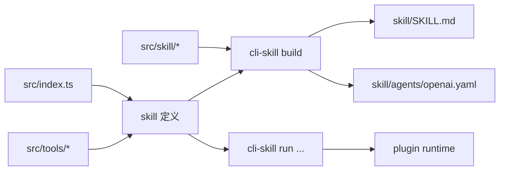

# cli-skill

`cli-skill` 是一套面向 agent skill 的开发工具链。

它覆盖的是一整条链路：

- 定义 skill
- 定义 tool
- 生成 agent 可读的 `skill/` 产物
- 在本地接通 skill
- 安装和发布可复用的 skill

## 包含什么

- `@cli-skill/cli`
  - 创建 skill 项目
  - 管理 skill
  - 构建产物
  - 安装、挂载和发布 skill
- `@cli-skill/core`
  - `defineSkill`
  - `defineTool`
  - 基于插件的运行时上下文
- `@cli-skill/templates`
  - 内置模板

## 关键能力

- 用统一模型定义可执行 skill
- 从源码模板生成 agent 可读的 `skill/` 产物
- 通过插件为 tool 注入运行时能力
- 把 skill 打包成独立项目
- 在本地挂载 skill 供 agent 使用
- 通过 skill 名安装已发布 skill
- 支持浏览器自动化作为第一类 skill 能力

## 项目模型

一个生成出来的 skill 项目分为源码和产物两部分。

源码：

- `src/index.ts`
- `src/tools/*`
- `src/skill/*`

产物：

- `skill/SKILL.md`
- `skill/agents/openai.yaml`

执行入口：

- skill 自己的 bin
- `cli-skill <skillName> ...`

## 命令模型

`cli-skill` 有两层命令。

平台命令：

- `cli-skill create <skillName> --cli-name <cliName>`
- `cli-skill list`
- `cli-skill install <skillName> [--packageName <packageName>]`
- `cli-skill uninstall <packageName>`
- `cli-skill config get [keyPath]`
- `cli-skill config set <keyPath> <value>`

skill 作用域命令：

- `cli-skill <skillName> list`
- `cli-skill <skillName> run <toolName> [rawInput]`
- `cli-skill <skillName> config get [keyPath]`
- `cli-skill <skillName> config set <keyPath> <value>`
- `cli-skill <skillName> config unset <keyPath>`
- `cli-skill <skillName> mount [targetPath]`
- `cli-skill <skillName> unmount [targetPath]`
- `cli-skill <skillName> build`
- `cli-skill <skillName> publish [--dry-run] [--tag <tag>]`

生成出来的 skill 仍然保留自己的 bin，但它只是一个很薄的转发层，最终仍然会进入：

- `cli-skill <skillName> ...`

## 架构



## 快速开始

```bash
cli-skill create my-skill --cli-name my-skill
cd ~/.cli-skill/skills/my-skill
bun install
cli-skill my-skill build
cli-skill my-skill mount
```

## 目录约定

- 本地 skill：
  - `~/.cli-skill/skills`
- 托管安装的 skill：
  - `~/.cli-skill/installed`
- agent 默认读取目录：
  - `~/.agents/skills`

## 仓库结构

- `packages/cli`
- `packages/core`
- `packages/templates`

## 开发

```bash
bun run bootstrap
bun run test
```
